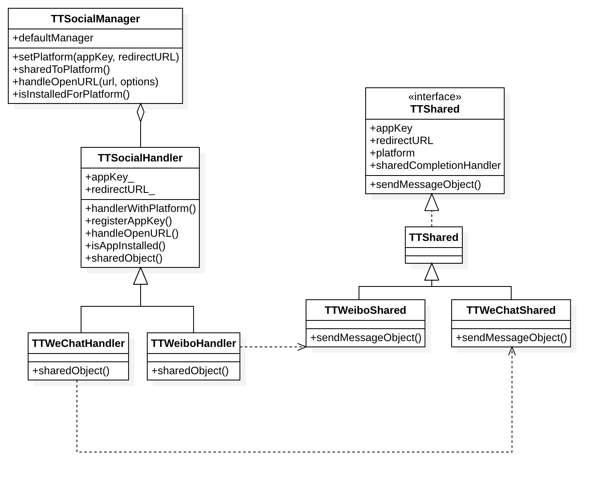

# TTSocialModule

简单封装第三方平台SDK，目前仅支持分享功能。

包含的SDK：微信、微博

# Feature

支持分享类型：

- [x] 文本
- [x] 图文
- [x] 网页
- [x] 小程序

# Usage

- Step 1 

注册第三方平台appKey

```objc
#import "TTSocialManager.h"

[[TTSocialManager defaultManager] setPlatform:TTSocialPlatformTypeWeChatSession appKey:WECHAT_APPKEY redirectURL:nil];

```

- Step 2 

分享到第三方平台

```objc
TTSocialMessageObject *messageObject = [TTSocialMessageObject new];
messageObject.text = @"分享文本";

[[TTSocialManager defaultManager] sharedToPlatform:TTSocialPlatformTypeWeChatSession messageObject:messageObject currentViewController:nil completionHandler:^(id  _Nullable data, NSError * _Nullable error) {
    NSLog(@"%@::分享后的回调！", NSStringFromClass(self.class));
}];
```

# Architecture

<p align="center">
    
<p>